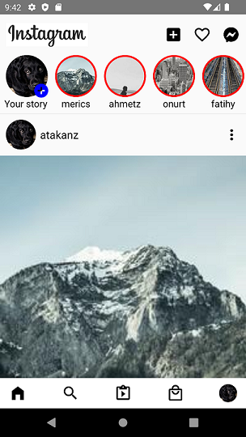

# Instagram 2022 Clone

In this project, the flow of Instagram's main page is redesigned using React Native. The project makes use of lorem picsum pictures and lorem sentences as data. MaterialCommunityIcons and Fontawesome were used to create the icons.
The data for the post section are available in .json format in the /src folder. Some styling priorities for views are shown in the list below. 

1) Navbar: The logo is at the beginning, and the icons are at the end with (marginLeft:auto). 
2) Stories: Horizontal scrollview, conditional styling (props.name===Your story ? styles.noBorder:styles.redBorder), header component of FlatList
3) Posts: FlatList, The data is read from a json file and sent to a custom component file as an item with props. 
4) Footer: is set to sticky with absolute position and bottom:0. 

